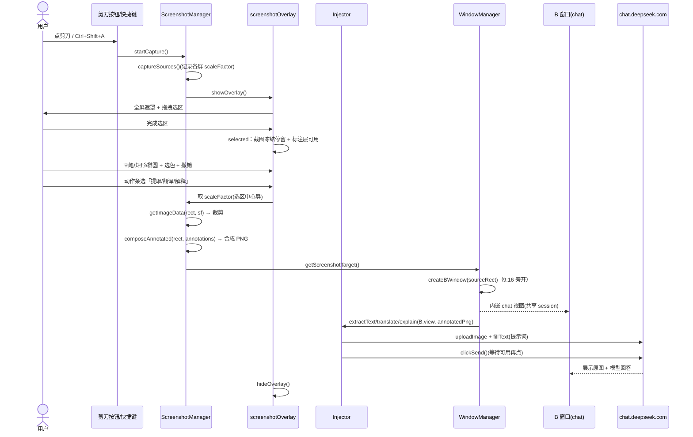
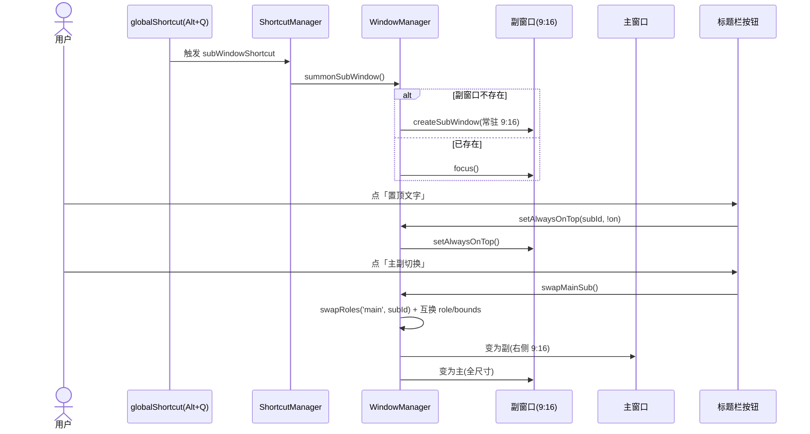

# DeepSeek 桌面端 · 增量系统设计与任务分解（架构视角）

> 角色：架构师 高见远
> 基线：`deepseek-desktop`（已建 Electron 应用，内嵌 chat.deepseek.com + 嵌入浏览器手动登录，配置 26 项）
> 输入：增量 PRD（`docs/incremental-prd.md`，I-01~I-09）
> 目标：在「最小改动」原则下，给出实现方案、变更文件清单、模块接口增量、时序图、有序任务列表、配置增量，并对 PRD §6 的开放项给出架构侧决断。
> 原则：**只改增量、不动既有能力契约；运行时零依赖；选择器唯一收口；IPC 通道单一来源；提示词占位符 `{content}{targetLang}`。**

---

## 1. 实现方案增量（最小改动策略）

### 1.1 总体策略
- **复用优先**：B 类窗口、副窗口、主窗口三者本质都是「标题栏外壳 + WebContentsView 内嵌 chat」的变体，全部复用 `mainWindow.ts` 的 `layoutView` 与 `createMainWindow` 的视图装配逻辑；不引入全新视图容器。
- **共享 session 即共享登录态**：所有窗口共用 `session.defaultSession`，登录态天然跨窗口一致，因此「主副切换 / B 窗口 / 副窗口」无需迁移登录态，只需迁移或切换 **WebContentsView 引用与位置**。
- **注入统一入口**：截图动作（提取/翻译/解释）最终都经 `Injector` 的既有方法注入目标视图；目标视图由新增的 `WindowManager.getScreenshotTarget()` 统一解析，解决 PRD §6 第 1、8 点。
- **状态机改造收敛在 overlay**：截图「停留+标注+动作」状态机只改 `screenshotOverlay.ts` 与其渲染层，不影响主流程的其它模块。
- **主题白屏修复收敛在装配顺序**：不新增模块，仅调整 `main.ts` 的装配时序 + 窗口工厂在创建时设 `backgroundColor`。

### 1.2 关键设计决断（对应 PRD §6）
| # | PRD 待确认 | 架构决断 |
|---|---|---|
| 1 | B 类窗口结果定向 | **注入目标 = B 窗口自身内嵌的 chat 视图**。B 窗口是一个更小的 9:16 常驻式 chat 视图，截图+提示词直接注入其 WebContentsView；其内「原图」即上传的标注 PNG，「结果」即 chat 回复流。无 B 窗口（如「复制」动作或未启用）时回退到活动窗口。由 `getScreenshotTarget()` 统一解析。 |
| 2 | 主副切换共享 session 语义 | **复用同一 WebContentsView 引用 + 交换 bounds/role**，不新建窗口。所有视图共享 session，对话内容随 view 移动而移动。扩展现有 `swapRoles(a,b)` 为「主/副」角色模型（`role: 'main'|'sub'`），`swapMainSub()` 即 `swapRoles('main', subId)` 并互换 role 标记与尺寸。 |
| 3 | 快捷键冲突 | `subWindowShortcut` 同样走 `globalShortcut` 注册；注册失败（非法或 OS 占用）时**保留上一可用集合并弹通知**；设置面板对三项快捷键做互斥校验（前缀/组合不可重复）。 |
| 4 | 标注撤销粒度 | **按对象栈**（每笔/每个形状为一项）逐级撤销，`undo()` 弹栈、`clear()` 清空；不实现 redo。 |
| 5 | 跨屏 DPI / B 窗口越界 | `scaleFactor` 取**选区中心所在屏**（`screen.getDisplayMatching`）。B 窗口旁开：基准 `rect.right + gap`，越右界则放左侧，垂直居中于选区并夹进屏内工作区。 |
| 6 | 白屏根因 | 确认根因：首次 `applyTheme`（main.ts:82）时 broadcaster 尚未注入（registerHandlers 在 85 行）。**修复**：在 `registerHandlers` 之前先 `theme.setBroadcaster(...)`；窗口 `ready-to-show` 时主动补发一次 CSS 变量；窗口创建即用主题底色 `setBackgroundColor`。 |
| 7 | 剪刀按钮注入稳定性 | `injectScissorsButton` 以 `FILE_INPUT_SELECTORS` 为锚点，在其**左侧相邻按钮前**插入；用 `MutationObserver` 监听容器变化重注入，并在 webview `did-finish-load`/`did-navigate` 重注入。选择器仍为单一收口，待实机校验。 |
| 8 | 复制 vs 发送到对话定向 | 统一规则：由 `getScreenshotTarget()` 给出目标。`copy` 与定向无关（写剪贴板即关）；`extract/translate/explain` 定向到 B 窗口视图；旧 `chat` 动作（保留兼容）定向到活动窗口。 |
| 9 | React 受控自动发送 | `clickSend(wc)` 改为**轮询等待发送按钮可用态（非 disabled / 可点击）后再 click**，重试若干次规避空发；`sendToChat` 等末端统一走该逻辑。 |

### 1.3 文件改动范围概览
- **改**：`types.ts` `constants.ts` `ConfigStore.ts` `channels.ts` `main.ts` `WindowManager.ts` `subWindow.ts` `mainWindow.ts` `ScreenshotManager.ts` `screenshotOverlay.ts` `Injector.ts` `ShortcutManager.ts` `handlers.ts` `shellPreload.ts` `webviewPreload.ts` `TrayManager.ts` `titlebar.{html,css,js}` `overlay.{html,css,js}` `deepseek-selectors.ts` `system_design.md` `sequence-diagram.mermaid` `class-diagram.mermaid`
- **新增**：`src/main/windows/bWindow.ts` + `src/renderer/shell/bwindow.{html,css,js}`、`src/main/windows/settingsWindow.ts` + `src/renderer/shell/settings.{html,css,js}`、标注相关并入 `overlay`（不单列文件）。

---

## 2. 变更文件列表（【改】/【新增】）

| 文件 | 标记 | 职责（一句） |
|---|---|---|
| `src/shared/types.ts` | 【改】 | 新增 `Annotation` / `OverlayState` / `SubWindowRole` 类型，扩展 `ConfigShape` 至 28 项，扩展 `IPCEventMap`。 |
| `src/main/constants.ts` | 【改】 | 新增 `SETTINGS_HTML`、`B_WINDOW_*` 尺寸常量、`SUB_WINDOW_RATIO=9/16`；`SUB_WINDOW_TYPES` 保持不变。 |
| `src/main/config/ConfigStore.ts` | 【改】 | `DEFAULT_CONFIG` 增 `subWindowShortcut`/`annotationColors`，`alwaysOnTop` 默认 `false→true`；`deepMerge` 无需改（数组/字符串按值替换）。 |
| `src/main/ipc/channels.ts` | 【改】 | 新增 IPC：`SETTINGS_OPEN`、`OVERLAY_SET_COLOR`、`OVERLAY_SET_TOOL`、`OVERLAY_UNDO`、`OVERLAY_CLEAR`、`OVERLAY_GET_ANNOTATIONS`、`SUB_SUMMON`、`SUB_SWAP`、`SCISSORS_TRIGGER`（webview→main）。 |
| `src/main/main.ts` | 【改】 | 调整装配时序（broadcaster 先于 applyTheme）、接线 `onSummonSub`/`onScissors`、webview ready 后调用 `injectScissorsButton`。 |
| `src/main/windows/WindowManager.ts` | 【改】 | `WindowEntry` 增 `role`；新增 `createBWindow`/`summonSubWindow`/`swapMainSub`/`getScreenshotTarget`；复用 `setAlwaysOnTop`。 |
| `src/main/windows/subWindow.ts` | 【改】 | 四类统一 9:16 常驻；标题栏含「置顶」「主副切换」；`closeToTray` 下隐藏。 |
| `src/main/windows/mainWindow.ts` | 【改】 | 创建窗口时按当前主题 `setBackgroundColor`；`ready-to-show` 补发 CSS 变量。 |
| `src/main/windows/bWindow.ts` | 【新增】 | B 类临时窗口工厂：更小 9:16、选区旁开、无主副切换、用完即关、不进托盘。 |
| `src/main/windows/settingsWindow.ts` | 【新增】 | 通用设置窗口工厂，经 IPC 读写 `ConfigStore` 热更新。 |
| `src/main/screenshot/ScreenshotManager.ts` | 【改】 | `getImageData(rect, scaleFactor)` 按缩放裁剪；`captureSources` 记录各屏 `scaleFactor`；新增 `getScaleFactorForRect`/`composeAnnotated`。 |
| `src/main/windows/screenshotOverlay.ts` | 【改】 | 支持状态机 `idle→selecting→selected→annotating→actionChosen`；截图冻结停留；暴露标注层与动作条回调。 |
| `src/main/inject/Injector.ts` | 【改】 | `clickSend` 公开且 wait-enabled；`sendToChat/extractText/translate/explain` 末端走 `submitToChat`；新增 `injectScissorsButton`（MutationObserver 重注入）。 |
| `src/main/shortcuts/ShortcutManager.ts` | 【改】 | `applyFromConfig` 注册 `subWindowShortcut`；新增 `onSummonSub` 回调；注册失败兜底。 |
| `src/main/ipc/handlers.ts` | 【改】 | 重写 `SCREENSHOT_ACTION` 为「停留→标注→动作」流程；extract/translate/explain 触发 B 窗口并注入 B 视图；注册新增 IPC 与配置副作用（subWindowShortcut/annotationColors）。 |
| `src/main/tray/TrayManager.ts` | 【改】 | 新增「设置」「呼出副窗口」「主副切换」菜单项。 |
| `src/preload/shellPreload.ts` | 【改】 | 暴露新 IPC（settings open、overlay 标注桥、sub summon/swap、onScreenshotTarget）。 |
| `src/preload/webviewPreload.ts` | 【改】 | 暴露 `injectScissors` 触发回调与 `onScissorsTrigger` 上报。 |
| `src/renderer/shell/titlebar.{html,css,js}` | 【改】 | 副/主窗口标题栏加「置顶」「主副切换」；全部窗口加「设置」入口。 |
| `src/renderer/shell/overlay.{html,css,js}` | 【改】 | 状态机 UI、冻结截图层、标注画布（pen/rect/ellipse + 颜色 + 撤销/清空）、动作条（提取/翻译/解释/复制/取消）。 |
| `src/renderer/shell/bwindow.{html,css,js}` | 【新增】 | B 窗口外壳渲染（标题栏 + WebContentsView 容器 + 关闭）。 |
| `src/renderer/shell/settings.{html,css,js}` | 【新增】 | 通用设置表单 UI，经 `shell.setConfig` 写回。 |
| `src/main/inject/deepseek-selectors.ts` | 【改】 | 细化 `FILE_INPUT` 锚点与「发送按钮可用态」判定选择器；新增剪刀按钮候选容器选择器。 |
| `docs/system_design.md` `docs/sequence-diagram.mermaid` `docs/class-diagram.mermaid` | 【改】 | 同步增量架构、时序、类图。 |
| `test/*.test.ts` | 【改】 | 增截图 DPI / 标注合成 / B 窗口 / 设置面板 / 主题白屏 的 mock 测试。 |

---

## 3. 模块接口增量（严格签名）

> 仅给出**变更/新增**的对外契约；未列出的既有方法签名保持不变（向后兼容）。
> `WebContents` / `BrowserWindow` 来自 `electron`；`ScreenshotRect`/`ThemeMode`/`ScreenshotAction`/`ConfigShape` 等来自 `src/shared/types`。

### 3.1 `src/shared/types.ts`（类型增量）
```ts
/** 标注对象（一笔/一个形状为一项，撤销按对象栈）。 */
export interface Annotation {
  tool: 'pen' | 'rect' | 'ellipse';
  color: string;
  /** pen：相对图片的折点序列（CSS 像素）。 */
  points?: { x: number; y: number }[];
  /** rect / ellipse：相对图片的包围盒（CSS 像素）。 */
  x?: number; y?: number; width?: number; height?: number;
}

/** 截图遮罩状态机。 */
export type OverlayState = 'idle' | 'selecting' | 'selected' | 'annotating' | 'actionChosen';

/** 窗口角色（扩展 swapRoles 为「主/副」语义）。 */
export type SubWindowRole = 'main' | 'sub';

/** ConfigShape 扩展至 28 项（仅列增量）： */
// subWindowShortcut: string;        // 默认 "Alt+Q"
// annotationColors: string[];       // 默认 ["#ff3b30","#34c759","#007aff","#ffcc00","#ffffff"]
// alwaysOnTop 默认值改为 true

/** IPCEventMap 增量（仅列新增通道载荷）： */
// 'settings:open': void;
// 'overlay:setColor': { color: string };
// 'overlay:setTool': { tool: 'pen' | 'rect' | 'ellipse' };
// 'overlay:undo': void;
// 'overlay:clear': void;
// 'overlay:annotations': Annotation[];
// 'sub:summon': void;
// 'sub:swap': void;
// 'scissors:trigger': void;   // webview -> main
```

### 3.2 `Injector`（`src/main/inject/Injector.ts`）
```ts
/** 公开：点击发送按钮，轮询等待其可用（非 disabled）后再 click，规避 React 受控空发。 */
public async clickSend(wc: WebContents): Promise<boolean>;

/** 新增：统一提交入口 = 上传图(可选) → 填文 → 等待可用并点发送。行为强化版 sendToChat。 */
public async submitToChat(wc: WebContents, text: string, img?: string): Promise<boolean>;

/** 改（签名不变，内部末端改走 clickSend 的 wait-enabled 逻辑）： */
public async sendToChat(wc: WebContents, text: string, img?: string): Promise<boolean>;
public async extractText(wc: WebContents, img: string): Promise<boolean>;   // 末端走 submitToChat
public async translate(wc: WebContents, text: string, lang: string): Promise<boolean>;  // 末端走 submitToChat
public async explain(wc: WebContents, text: string): Promise<boolean>;      // 末端走 submitToChat

/** 不变：uploadImage / switchToVisionModel / detectLogin / readLatestResponse */

/** 新增：在 FILE_INPUT_SELECTORS 锚点左侧插入剪刀按钮；MutationObserver 监听 SPA 重渲染重注入；点击回调 onTrigger。 */
public async injectScissorsButton(wc: WebContents, onTrigger: () => void): Promise<boolean>;
```
> 决断：注入目标即方法首参 `wc`（由 `WindowManager.getScreenshotTarget()` 预先解析），因此 PRD 所述「可选 `targetWc?`」被该解析取代，**不新增冗余参数**，保持签名最小。

### 3.3 `ScreenshotManager`（`src/main/screenshot/ScreenshotManager.ts`）
```ts
/** 改：返回各屏 source 并内部记录每屏 scaleFactor（按 display.id 映射）。 */
public async captureSources(): Promise<Electron.DesktopCapturerSource[]>;

/** 改：按 scaleFactor 缩放裁剪（cropRect = rect × scaleFactor）；rect 为 CSS 像素。 */
public getImageData(rect: ScreenshotRect, scaleFactor: number): Electron.NativeImage | null;

/** 新增：取选区中心所在屏的 scaleFactor（screen.getDisplayMatching）。 */
public getScaleFactorForRect(rect: ScreenshotRect): number;

/** 新增：将标注对象合成进裁剪后的 PNG，返回合成图（失败返回 null）。 */
public composeAnnotated(rect: ScreenshotRect, annotations: Annotation[]): Electron.NativeImage | null;

/** 不变：selectRegion / saveToFile / copyToClipboard / captureRegion / hideOverlayNow */
```

### 3.4 `screenshotOverlay`（`src/main/windows/screenshotOverlay.ts` + 渲染层）
```ts
/** 改：显示遮罩并进入 selecting 状态（截图流程由主进程驱动状态机）。 */
export function showOverlay(): void;
export function hideOverlay(): void;

/** 渲染层（overlay.js 经 shell 桥暴露，主进程注入回调）： */
// setColor(color: string): void
// setTool(tool: 'pen' | 'rect' | 'ellipse'): void
// undo(): void
// clear(): void
// getAnnotations(): Annotation[]
// onAction(cb: (action: ScreenshotAction) => void): void   // 动作条回调：extract/translate/explain/copy/cancel
```
> 状态机：`idle → selecting（拖拽选区）→ selected（截图冻结停留）→ annotating（标注层可用，可与动作并行）→ actionChosen（选动作，提交/关闭）`。未关闭前可重选选区与动作。

### 3.5 `WindowManager`（`src/main/windows/WindowManager.ts`）
```ts
/** WindowEntry 增量：role?: SubWindowRole（'main' | 'sub'），主窗口固定 main。 */

/** 新增：B 类临时窗口。更小 9:16，选区旁开，无主副切换，用完即关，不进托盘、不入常驻列表。返回 id 或 null。 */
public createBWindow(sourceRect: ScreenshotRect): string | null;

/** 新增：Alt+Q 呼出/聚焦常驻副窗口（无则创建，有则聚焦）。返回副窗口 id。 */
public summonSubWindow(): string;

/** 新增：主副切换。扩展 swapRoles 为 main/sub 角色（交换 bounds + role 标记 + WebContentsView 引用）。 */
public swapMainSub(): boolean;

/** 新增：返回当前截图动作目标 webContents（优先 B 窗口视图，否则活动窗口）。 */
public getScreenshotTarget(): WebContents | null;

/** 复用：createMainWindow / createSubWindow / copyWindow / setAlwaysOnTop / toggleMainWindow / getActiveWebContents / findIdByWebContents / getShellWebContentsList */
```

### 3.6 `ShortcutManager`（`src/main/shortcuts/ShortcutManager.ts`）
```ts
/** 改：applyFromConfig 读取并注册 subWindowShortcut（默认 "Alt+Q"）；注册失败保留上一集合。 */
public applyFromConfig(cfg: ConfigShape): void;

/** 新增：副窗口呼出回调（对应 subWindowShortcut）。 */
public onSummonSub: (() => void) | null;
```

### 3.7 `ThemeManager`（`src/main/theme/ThemeManager.ts`）
```ts
/** 签名不变；修复在 main.ts 装配顺序（setBroadcaster 先于首次 applyTheme）+ 窗口工厂 setBackgroundColor + ready-to-show 补发。 */
public applyTheme(mode: ThemeMode): void;
public setBroadcaster(fn: ThemeBroadcaster): void;
```
> 另：窗口工厂（`mainWindow.ts`/`subWindow.ts`）新增「创建时按 `nativeTheme.shouldUseDarkColors` + `config.theme` 计算底色并 `win.setBackgroundColor`」；`win.once('ready-to-show')` 内主动 `wc.send(THEME_VARS, vars)` 补发一次。

### 3.8 `SettingsWindow`（`src/main/windows/settingsWindow.ts`）（新增）
```ts
export class SettingsWindow {
  /** 打开（已开则聚焦）；单例。 */
  public open(): void;
  /** 关闭并销毁。 */
  public close(): void;
}
```
> 渲染层 `settings.{html,css,js}` 经 `shell.getConfig/setConfig` 读写 `ConfigStore`，改动即时落盘并触发 `handlers.applyConfigSideEffects` 热更新。

### 3.9 `PromptTemplates`（`src/main/prompts/promptTemplates.ts`）
```ts
/** 不变。设置面板仅暴露其既有模板（visionPromptTemplate / extractTextPromptTemplate / translatePromptTemplate / explainPromptTemplate）。 */
```

---

## 4. 时序图增量（Mermaid sequenceDiagram）

### 4.1 截图触发 → 选区 → 停留 → 标注 → 选动作 → 注入 B 窗口


### 4.2 副窗口 Alt+Q 呼出 → 置顶切换 → 主副切换


---

## 5. 增量任务列表（有序，含依赖）

> 编号 TI-01~TI-22，按依赖排列；每项注明「文件 + 描述 + 依赖前置」。覆盖 I-01~I-09。
> 约定：`types`=`src/shared/types.ts`；`constants`=`src/main/constants.ts`；`config`=`ConfigStore.ts`；`channels`=`ipc/channels.ts`；`wm`=`windows/WindowManager.ts`；`sub`=`windows/subWindow.ts`；`mainw`=`windows/mainWindow.ts`；`sm`=`screenshot/ScreenshotManager.ts`；`ov`=`windows/screenshotOverlay.ts`+`renderer/shell/overlay.*`；`inj`=`inject/Injector.ts`；`sc`=`shortcuts/ShortcutManager.ts`；`h`=`ipc/handlers.ts`；`mt`=`main.ts`；`sp`=`preload/shellPreload.ts`；`wp`=`preload/webviewPreload.ts`；`tray`=`tray/TrayManager.ts`；`tb`=`renderer/shell/titlebar.*`；`sel`=`inject/deepseek-selectors.ts`。

- **TI-01**【types】新增 `Annotation`/`OverlayState`/`SubWindowRole`；`ConfigShape` 扩 28 项；`IPCEventMap` 增量。依赖：无。
- **TI-02**【constants】新增 `SETTINGS_HTML`、`B_WINDOW_*`、`SUB_WINDOW_RATIO`。依赖：无。
- **TI-03**【config】`DEFAULT_CONFIG` 增 `subWindowShortcut`/`annotationColors`，`alwaysOnTop` 默认改 `true`（deepMerge 向后兼容）。依赖：TI-01。
- **TI-04**【channels】新增 9 个 IPC 通道（见 §3.1）。依赖：TI-01。
- **TI-05**【主题白屏修复·装配】`mt` 调整时序（`setBroadcaster` 先于首次 `applyTheme`）；`mainw`/`sub` 创建时 `setBackgroundColor`；`ready-to-show` 补发 `THEME_VARS`。依赖：无。
- **TI-06**【wm】`WindowEntry` 增 `role`；新增 `createBWindow`/`summonSubWindow`/`swapMainSub`/`getScreenshotTarget`；复用 `setAlwaysOnTop`。依赖：TI-01。
- **TI-07**【sub】四类统一 9:16 常驻；标题栏含「置顶/主副切换」钩子；`closeToTray` 隐藏。依赖：TI-06。
- **TI-08**【mainw】创建时按主题 `setBackgroundColor`（已含于 TI-05，独立收口）。依赖：TI-05。
- **TI-09**【sm】`getImageData(rect, sf)` 按缩放裁剪；`captureSources` 记录各屏 `scaleFactor`；`getScaleFactorForRect`；`composeAnnotated`。依赖：TI-01。
- **TI-10**【ov】状态机 `idle→…→actionChosen`；截图冻结停留；标注层（pen/rect/ellipse + 颜色 + undo/clear）；动作条 extract/translate/explain/copy/cancel。依赖：TI-01、TI-04。
- **TI-11**【inj】`clickSend` 公开+wait-enabled；`sendToChat/extractText/translate/explain` 末端走 `submitToChat`；新增 `injectScissorsButton`（MutationObserver 重注入）。依赖：TI-09。
- **TI-12**【bWindow 新增】`windows/bWindow.ts` + `renderer/shell/bwindow.{html,css,js}`：更小 9:16 临时窗、选区旁开、用完即关、不进托盘。依赖：TI-06。
- **TI-13**【settings 新增】`windows/settingsWindow.ts` + `renderer/shell/settings.{html,css,js}`：通用设置表单，经 IPC 读写 `ConfigStore`。依赖：TI-03、TI-04。
- **TI-14**【sc】`applyFromConfig` 注册 `subWindowShortcut`；新增 `onSummonSub`；注册失败兜底 + 设置面板冲突校验。依赖：TI-03。
- **TI-15**【h】重写 `SCREENSHOT_ACTION` 为停留→标注→动作；extract/translate/explain 触发 B 窗口并注入 B 视图；copy→clipboard；注册新增 IPC（`settings:open`/`overlay:*`/`sub:summon`/`sub:swap`/`scissors:trigger`）；配置副作用加 `subWindowShortcut`/`annotationColors`。依赖：TI-06、TI-09、TI-10、TI-11、TI-12、TI-13。
- **TI-16**【mt】装配 `onSummonSub`/`onScissors`；`webview` ready 后调用 `inj.injectScissorsButton`；broadcaster 顺序修复（TI-05）。依赖：TI-05、TI-11、TI-14。
- **TI-17**【sp/wp】暴露新 IPC 与回调（`settings:open`、`overlay:setColor/setTool/undo/clear`、`sub:summon`/`sub:swap`、`onScreenshotTarget`、`scissors:trigger` 上报）。依赖：TI-04、TI-13。
- **TI-18**【tray】新增「设置」「呼出副窗口」「主副切换」菜单项。依赖：TI-13、TI-06。
- **TI-19**【tb】副/主窗口标题栏加「置顶」「主副切换」；全部窗口加「设置」入口。依赖：TI-06。
- **TI-20**【sel】细化 `FILE_INPUT` 锚点与「发送按钮可用态」判定选择器；新增剪刀按钮候选容器选择器。依赖：无（先于 TI-11 校验）。
- **TI-21**【test】增截图 DPI 缩放 / 标注合成 / B 窗口 / 设置面板 / 主题白屏 的 mock 测试。依赖：TI-01~TI-20。
- **TI-22**【docs】同步 `system_design.md`/`sequence-diagram.mermaid`/`class-diagram.mermaid` 反映增量。依赖：全部。

**依赖链摘要**：`TI-01/02/20` → `TI-03/04` → `TI-06/09/13` → `TI-07/10/11/12/14` → `TI-15/17/18/19` → `TI-16` → `TI-21/22`；`TI-05/08` 独立收口主题修复。

---

## 6. 配置增量（26 → 28）

| key | 类型 | 默认（新装/重置） | 说明 | 关联 |
|---|---|---|---|---|
| `subWindowShortcut` | string | `"Alt+Q"` | 一键呼出/聚焦副窗口全局快捷键 | I-08 / I-09 |
| `annotationColors` | string[] | `["#ff3b30","#34c759","#007aff","#ffcc00","#ffffff"]` | 标注画笔色板，设置面板可编辑 | I-05 / I-09 |
| `alwaysOnTop` | boolean | `true`（原 `false`） | 默认窗口置顶（豆包习惯） | I-08 / I-09 |

**向后兼容（backward-compatible）**：
- `ConfigStore.deepMerge` 对**数组/字符串按值替换**、仅对象字段递归合并。新增的 `subWindowShortcut`（字符串）、`annotationColors`（数组）在旧 config 缺失时由 `DEFAULT_CONFIG` 补默认；旧 config 若已存在则保留原值。
- `alwaysOnTop` 默认值改为 `true`：**仅影响新装与重置用户**；旧 config 含 `alwaysOnTop:false` 时深度合并保留 `false`（尊重用户既有选择），无破坏性升级。
- 其余 26 项全部保留，设置面板集中暴露（见 PRD §5.3）。`screenshotAfterAction` 语义在 I-04 改为停留选择后，作为「无标注直接提交兜底」保留，不删除。

---

## 7. 待明确事项（遗留）

> 架构侧已能决断的已在 §1.2 给出默认值；此处仅列**真正遗留**、需实机或用户侧确认的开放点。

1. **真实 DOM 选择器待实机校验**：`FILE_INPUT_SELECTORS`、上传按钮相邻锚点、`SEND_BUTTON` 可用态判定选择器均为推测值。`injectScissorsButton` 的插入位置与重注入时机（MutationObserver vs `did-navigate`）需在 `chat.deepseek.com` 实机用 DevTools 核对后微调——选择器唯一收口于 `deepseek-selectors.ts`，改动不波及其它模块。
2. **B 窗口内「原图预览」呈现方式**：本设计采用最小改动——B 窗口内嵌整页 chat，原图即上传的标注 PNG、结果即 chat 回复流（不另建上下分栏 UI）。若产品坚持 PRD §4.3 的「上图下文」分栏形态，需追加一个轻量预览层（评估为后续增量，非本次阻塞）。
3. **`subWindowShortcut` 与第三方软件冲突**：已设计注册失败兜底 + 设置面板互斥校验，但「与其它 App 全局键冲突」无法在应用内彻底规避，需用户侧在设置面板自行调整。
4. **`enableRoleSwap=false` 时的按钮可用性**：主副切换总开关关闭时，`swapMainSub` 直接返回 `false`，标题栏「主副切换」按钮置灰——该行为已定，仅 UI 置灰样式待 `titlebar` 落地时确认。
5. **跨屏 DPI 边界的极端情况**：选区分跨多屏且中心落在缝隙时 `getDisplayMatching` 的归属，以及 B 窗口在跨屏越界时的夹紧策略，已给默认算法（§1.2 第 5 点），极端分辨率组合（如 1.25/1.5 混用）建议联调时抽样验证。

---

## 8. 与基线的兼容性确认（收尾）
- 既有 `Injector` 的 `sendToChat/extractText/translate/explain` **对外签名不变**，仅强化末端自动发送可靠性（I-06）。
- 既有 `subWindow.ts` 四类入口保留，默认形态统一为 9:16 副窗口（I-08）；`translate` 仍走 `translate.html` 独立 UI。
- 既有 `screenshotOverlay` 由「选区即提交」扩展为状态机，不影响其它 IPC 通道。
- 配置向后兼容（§6 已说明）。
- 运行时零依赖、外壳原生 HTML/CSS/JS、IPC 通道单一来源、选择器唯一收口——四条基线约束全程保持。
