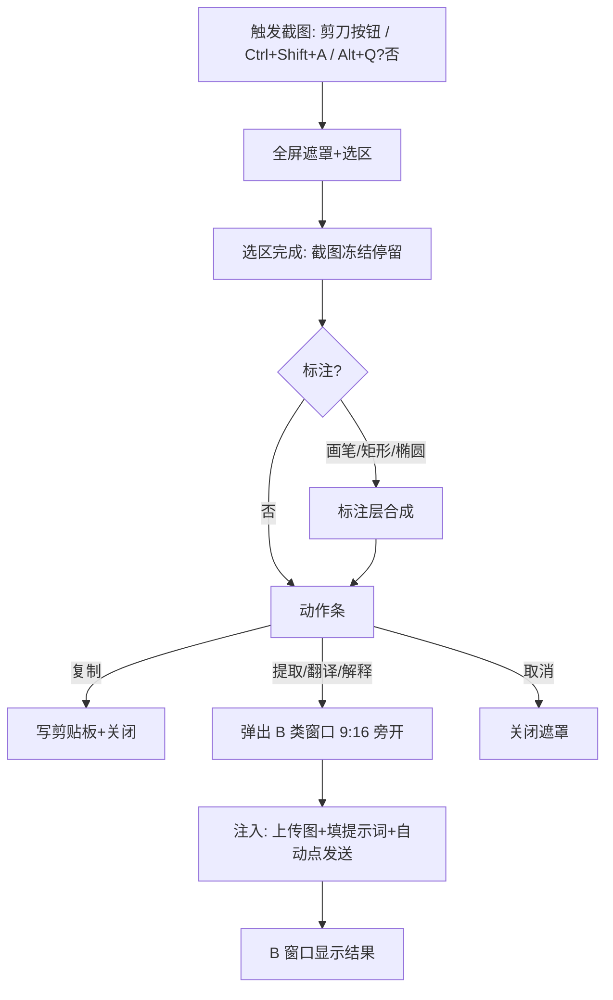
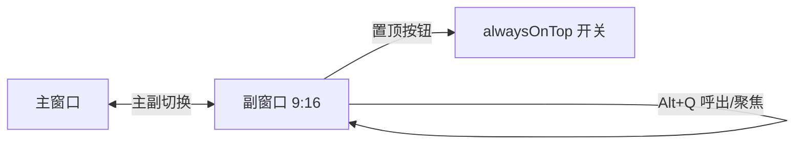

# DeepSeek 桌面端 · 增量 PRD（变更部分）

> 角色：产品经理 许清楚
> 基线：上一轮已交付的 Electron 桌面应用（`deepseek-desktop`，内嵌 chat.deepseek.com + 嵌入浏览器手动登录，配置 26 项）。
> 范围：**仅描述本次增量变更**，未提及的既有能力维持不变。
> 三类决策仍锁定：Electron + WebContentsView 内嵌网页版 + 嵌入浏览器手动登录。

---

## 1. 变更摘要

本次增量围绕「截图交互重构 + 豆包式主副窗口体系 + 主题/清晰度缺陷修复」三条主线展开：

- **入口增强**：在 DeepSeek 网页输入框「上传文件按钮」左侧注入一个剪刀图标截图按钮，把截图触发从纯全局快捷键延伸到网页内一键触发。
- **缺陷修复**：① 启动即正确应用主题，消除首次白屏；② 修复高 DPI 下截图区域比选区更小的缩放问题（选区 × scaleFactor）；③ 补全截图后「上传图片 + 填提示词 + 自动点发送」的最后一步，确保真正发送。
- **截图交互重构**：选区后截图**停留不消失**，先进入「标注 + 动作选择」阶段——可在截图上用多色画笔、矩形/椭圆框做标注，再选择「提取文字 / 翻译 / 解释 / 复制」等动作，而非截图后立刻提交。
- **窗口体系（对标豆包）**：引入「B 类临时窗口」（点击提取/翻译/解释后在选区旁弹出、比副窗口更小的 9:16 临时窗）与「常驻副窗口」（9:16、可一键呼出、带置顶开关与主副切换），并新增通用设置面板（提示词等注入内容可调、默认置顶可调、副窗口呼出快捷键可调）。

---

## 2. 更新 / 新增用户故事（仅受影响部分）

**US-S1（截图入口）** — As a 经常截图提问的用户 / I want 在网页输入框旁边直接点剪刀按钮截图 / So that 不必再去记全局快捷键或移动鼠标到标题栏。

**US-S2（启动主题）** — As a 使用系统深色主题的用户 / I want 应用一启动窗口就是深色 / So that 不会先看到刺眼的白屏。

**US-S3（截图清晰度）** — As a 在高分屏（125%/150%/200% 缩放）上使用的用户 / I want 提交的截图与我在屏幕上框选的区域完全吻合 / So that 不会截到比选区更小的图。

**US-S4（截图后停留+标注+选择）** — As a 截图后要圈重点再提问的用户 / I want 选区后截图停在屏幕上、可画笔/框选标注、再决定提取/翻译/解释/复制 / So that 我的标注和意图一起发给模型，提升回答质量。

**US-S5（自动发送）** — As a 点了「提取/翻译/解释」的用户 / I want 系统自动把图+提示词填好并点发送 / So that 我不用再手动敲回车。

**US-B1（B 类临时窗口）** — As a 只想临时看一眼截图解释/翻译结果的用户 / I want 点完动作后在选区旁边弹出一个小 9:16 窗口显示结果 / So that 不打断主对话流，用完即关。

**US-W1（常驻副窗口）** — As a 多任务用户 / I want 随时一键呼出一个 9:16 小窗口，可置顶、可与主窗口切换 / So that 边查资料边聊，参照豆包的操作习惯。

**US-W2（主副切换）** — As a 用户 / I want 主窗口和副窗口上各有一个「主副切换」按钮，点一下把当前窗变副窗（对话搬到右边）、对方变主窗 / So that 对话焦点随手调度。

**US-C1（通用设置）** — As a 用户 / I want 在设置面板里改提示词模板、默认置顶、副窗口呼出快捷键等 / So that 常用行为不用改代码就能调。

---

## 3. 需求池变更

约定：每条标注 **【修改现有】** 或 **【新增】**；优先级沿用基线 P0 > P1 > P2；关联原设计编号（W=窗口 / S=截图 / TH=主题 / I=注入 / C=配置 / T=翻译 / V=识图）。

| 编号 | 类型 | 标题 | 优先级 | 关联 |
|---|---|---|---|---|
| **I-01** | 【新增】 | 网页输入框内截图按钮（剪刀图标，位于上传按钮左侧） | P1 | I-注入 / S-截图 |
| **I-02** | 【修改现有】 | 主题启动即正确应用（修复白屏） | P0 | TH-主题 |
| **I-03** | 【修改现有】 | 截图 DPI 缩放修复（选区 × scaleFactor） | P0 | S-截图 |
| **I-04** | 【修改现有】 | 截图后停留 + 动作选择（不再立即提交） | P0 | S/overlay |
| **I-05** | 【新增】 | 标注画布（多色画笔 + 矩形框 + 椭圆框 + 撤销） | P1 | I-04 之上 |
| **I-06** | 【修改现有】 | 自动点击发送（填图+提示词后可靠点发送） | P0 | I-注入 / sendToChat |
| **I-07** | 【新增】 | B 类临时窗口（9:16 更小，选区旁开，临时） | P1 | W-副窗口 / I-04 |
| **I-08** | 【修改现有】 | 副窗口重构（9:16 常驻 + 呼出快捷键 + 置顶开关 + 主副切换） | P0 | W-副窗口 / 豆包对标 |
| **I-09** | 【新增】 | 通用设置面板（提示词/默认置顶/呼出快捷键等可调） | P1 | C-配置 |

### I-01 网页内截图按钮【新增】
- 在 `chat.deepseek.com` 对话框的「上传文件按钮」**左侧**注入一个按钮，图标为**剪刀符号**（✂ 或 SVG 剪刀）。
- 点击该按钮等价于触发 `ScreenshotManager.startCapture()`（与全局 `Ctrl+Shift+A` 同一条截图入口）。
- 注入通过 `Injector` 在页面 `load`/`DOM 稳定`后执行；插入锚点依赖 `deepseek-selectors.ts` 的 `FILE_INPUT_SELECTORS`（**待实机验证**选择器准确性）。
- 按钮样式跟随网页输入框风格（浅/深主题下可见），注入内容需随主题切换/页面重载保持存活（建议 MutationObserver 或导航后重注入）。

### I-02 主题启动即应用【修改现有】
- **现象**：系统为深色主题时，应用启动先白屏，需手动点一次「主题」才全变深色。
- **目标**：应用启动（首帧绘制前）即按 `theme` 配置（`light/dark/system`）把外壳标题栏、窗口背景、CSS 变量一次性正确应用，无白屏闪烁。
- 范围：① 创建窗口时根据当前主题设 `backgroundColor`；② 主题 CSS 变量在渲染层就绪前完成下发（修复「broadcaster 晚于首次 applyTheme 注册」导致的首帧丢失，见 §6 根因假设）；③ `system` 模式需在窗口创建前读取系统深浅并据此定底色。

### I-03 截图 DPI 缩放修复【修改现有】
- **现象**：高 DPI（缩放 >100%）下，提交截图比框选区域更小。
- **目标**：裁剪坐标按 `scaleFactor`（= `devicePixelRatio` / `display.scaleFactor`）换算——`cropRect = selectedRect × scaleFactor`，使输出像素与屏幕真实像素一致。
- 需同时处理：多显示器时选区的屏幕归属（用 `screen.getDisplayMatching(rect)` 取对应 `scaleFactor`）；遮罩本身用 CSS 像素绘制不受影响，仅裁剪阶段换算。
- 影响 `ScreenshotManager.getImageData()` 当前 1:1 裁剪逻辑（见基线注释「待联调」）。

### I-04 截图后停留 + 动作选择【修改现有】
- **当前**：选区后遮罩立即关闭并走 `screenshot:action` 提交。
- **改为**：选区完成后，**遮罩与截图保持可见**（截图像素冻结显示在选区上），进入「标注 + 动作」阶段；用户再从动作条选「提取文字 / 翻译 / 解释 / 复制 / 取消」。
- 动作条在标注工具栏下方常驻，截图未关闭前可重复调整选区/重选动作。
- 「复制」直接写剪贴板并关闭；「取消」关闭遮罩。

### I-05 标注画布【新增】（构建于 I-04 之上）
- 在冻结的截图上叠加可绘制的标注层（Canvas 或 SVG）。
- 工具：**多色画笔**（颜色取自 `annotationColors` 色板）、**矩形框**、**椭圆框**。
- 工具栏含：颜色选择、画笔、矩形、椭圆、撤销、清空/完成。
- 标注随截图一起作为最终图片提交（标注合成进 PNG）。
- 撤销粒度见 §6 待确认（建议「按笔画/按形状」逐级撤销）。

### I-06 自动点击发送【修改现有】
- **现象**：选完提取/翻译/解释后，系统已上传截图并填入提示词，但没自动点发送。
- **目标**：在 `Injector.sendToChat` 的「上传图 → 填文 → 点发送」链路末端，确保可靠触发发送按钮点击（监听发送按钮可用态后再点，规避 React 受控组件未刷新导致的空发）。
- 对提取/翻译/解释三类动作统一生效；对 B 类窗口（I-07）与副窗口/主窗口（I-08）均复用同一发送逻辑，目标 webContents 按 §6 定向规则选定。

### I-07 B 类临时窗口【新增】
- **触发**：在截图标注阶段点了「提取文字 / 解释 / 翻译」之一后，才弹出（不是截完图立即弹）。
- **形态**：比副窗口更小、同为 **9:16 手机比例**的临时窗口；无主副切换按钮。
- **位置**：出现在截图选区**旁边**（优先右侧；右侧越界则左侧；上下空间不足则上方/下方），避免遮挡选区。
- **内容**：上区为「原图/原文预览」，下区为「模型结果」（结果由注入到对应 chat 视图后回填，或直接在 B 窗口内嵌的 chat 视图呈现）。
- **生命周期**：临时、用完即关（关闭/再次截图/切到其它窗口可关）；不写入常驻窗口列表、不进托盘。

### I-08 副窗口重构【修改现有】（对标豆包）
- 将现有 `subWindow.ts` 四类窗口统一为**常驻副窗口**：固定 **9:16 比例**小窗（如宽 360 / 高 640，可设最小尺寸），内嵌 chat.deepseek.com（共享 session）。
- **一键呼出**：新增全局快捷键 `subWindowShortcut`（默认 `Alt+Q`）随时呼出/聚焦副窗口（关联 I-09 设置项）。
- **置顶开关**：副窗口标题栏含「置顶文字」按钮 = `alwaysOnTop` 快捷开关，与设置项 `alwaysOnTop` 同源（开/关即调 `win.setAlwaysOnTop`）。
- **主副切换**：主窗口与副窗口标题栏各有一个「主副切换」按钮。点击后：当前窗口变「副窗」（对话/视图搬到右侧），对方变「主窗」。语义见 §6（复用现有 `WindowManager.swapRoles` 并扩展为「主/副」角色而非任意类型交换）。
- 副窗口可随时关闭/再呼出；关闭不退出进程（受 `closeToTray` 影响可隐藏）。

### I-09 通用设置面板【新增】
- 新增设置入口（标题栏「设置」按钮或托盘菜单），以表单形式暴露可调项：
  - **提示词模板**：`visionPromptTemplate` / `extractTextPromptTemplate` / `translatePromptTemplate` / `explainPromptTemplate`（多行文本，支持 `{content}{targetLang}` 占位符说明）。
  - **默认置顶**：`alwaysOnTop`（默认改 `true`）。
  - **副窗口呼出快捷键**：`subWindowShortcut`（文本输入 + 校验，默认 `Alt+Q`）。
  - **标注色板**：`annotationColors`（可选，色块编辑）。
  - 其余既有 26 项可在此面板集中管理（见 §5 清单）。
- 改动即时写 `config.json` 并通知相关模块（主题/快捷键/窗口）热更新。

---

## 4. UI 设计增量

### 4.1 网页输入框 · 剪刀截图按钮位置
位于 DeepSeek 对话框底部工具栏，在「上传文件」按钮**左侧**插入：

```
┌───────────────────────────────────────────────────────────┐
│  说点什么…（输入框）                                        │
│                                            [✂] [📎上传] [发送] │  ← ✂ = 新增截图按钮，紧邻上传左侧
└───────────────────────────────────────────────────────────┘
```
- 图标：剪刀（✂），hover 显示「截图」tooltip；主题切换时同步配色。
- 点击 → 触发与 `Ctrl+Shift+A` 相同流程（进入截图遮罩）。

### 4.2 截图遮罩改造（选区后停留 + 标注 + 动作）
原：全屏半透明 → 拖拽选区 → 动作条 → 立即提交关闭。
新：全屏半透明 → 拖拽选区 → **截图冻结停留** → 显示「标注工具栏」+「动作条」→ 选动作后才提交。

```
┌───────────────────────────────────────────────────────────┐
│  (全屏半透明遮罩，选区外变暗)                                │
│        ┌───────────────────────┐                           │
│        │     选区（截图冻结显示） │                          │
│        │   ┌───────────────┐    │   ← 标注层叠加在截图上       │
│        │   │  ● 画笔标注     │    │                          │
│        │   └───────────────┘    │                          │
│        └───────────────────────┘                           │
│   ┌── 标注工具栏 ──────────────────────────────┐           │
│   │ 🎨颜色 ●● 画笔 ✏  矩形 ▭  椭圆 ◯  撤销 ↶ 清空 │          │
│   └────────────────────────────────────────────┘           │
│   ┌── 动作条 ──────────────────────────────────┐           │
│   │ 提取文字 │ 翻译 │ 解释 │ 复制 │ 取消          │          │
│   └────────────────────────────────────────────┘           │
└───────────────────────────────────────────────────────────┘
```
- 选区后可重新拖拽调整；标注与动作并行可用。
- 选「提取/翻译/解释」→ 进入 I-07 B 类窗口流程（或按 §6 定向到副窗口/主窗口）；选「复制」→ 写剪贴板关闭；选「取消」→ 关闭。

### 4.3 B 类临时窗口形态（9:16 更小，选区旁开）
```
        ┌─────────┐
        │ B类窗口  │  ← 宽≈副窗口的 70%，高=宽×16/9，9:16
        │ ┌─────┐  │
        │ │原文/ │  │  ← 上：原图预览（含标注）
        │ │原图  │  │
        │ └─────┘  │
        │ ┌─────┐  │
        │ │结果  │  │  ← 下：模型回答（滚动）
        │ │      │  │
        │ └─────┘  │
        │  [关闭]  │
        └─────────┘
   (出现在选区右侧；越界则左侧/上/下)
```
- 无主副切换按钮；关闭即销毁。
- 位置算法：`base = rect 右侧 + 间距`；若 `base + winW > 屏幕右界` 则放左侧；垂直居中于选区，越界则夹到屏内。

### 4.4 副窗口形态（9:16 右侧常驻）
```
┌──────────────┐   ┌──────────────┐
│   主窗口      │   │  副窗口(9:16) │
│  (chat)      │   │ ┌──────────┐ │
│              │   │ │ DeepSeek │ │  ← 内嵌 chat.deepseek.com
│ [主副切换]◄──┼───┤ ├──────────┤ │
│              │   │ │[置顶][切换]│ │  ← 置顶=alwaysOnTop开关
│              │   │ │ 对话内容   │ │     切换=与主窗互换
│              │   │ └──────────┘ │
└──────────────┘   └──────────────┘
   呼出：Alt+Q（默认）随时显隐/聚焦副窗口
```
- 标题栏按钮：`[置顶文字]`（切换 alwaysOnTop）、`[主副切换]`。
- 常驻，可拖拽移动；关闭受 `closeToTray` 约束（可隐藏不退出）。

### 4.5 通用设置面板（表单）
```
┌─ 设置 ───────────────────────────────┐
│ 主题:        [浅|深|跟随系统]          │
│ 默认置顶:    [✓] (alwaysOnTop)        │
│ 副窗呼出键:  [Alt+Q________] (subWindowShortcut) │
│ 截图快捷键:  [Ctrl+Shift+A_]          │
│ 显隐主窗键:  [Alt+`]                  │
│ 标注色板:    [●红][●绿][●蓝][●黄][●白] │
│ ── 提示词模板 ──                      │
│ 识图:  [请识别并描述这张图片…]         │
│ 提取:  [请提取图片中的所有文字…]       │
│ 翻译:  [请将以下内容翻译为{targetLang}：\n{content}] │
│ 解释:  [请详细解释以下内容…{content}]  │
│ ── 更多 ──                           │
│ 字体大小/翻译源语言/目标语言/代理/落盘路径/开机自启… │
│ [保存] [重置默认]                     │
└──────────────────────────────────────┘
```

### 4.6 关键流程（Mermaid）





---

## 5. 配置项增量（基于原 26 项）

### 5.1 新增 key
| key | 类型 | 默认值 | 说明 | 关联 |
|---|---|---|---|---|
| `subWindowShortcut` | string | `"Alt+Q"` | 一键呼出/聚焦副窗口的全局快捷键 | I-08 / I-09 |
| `annotationColors` | string[]（可选） | `["#ff3b30","#34c759","#007aff","#ffcc00","#ffffff"]` | 标注画笔色板，设置面板可编辑 | I-05 / I-09 |

> 配置总数由 26 → **28** 项。`ConfigShape` 与 `DEFAULT_CONFIG` 需同步扩展，老配置缺此两项时深度合并补默认。

### 5.2 修改默认值
| key | 原默认 | 新默认 | 说明 | 关联 |
|---|---|---|---|---|
| `alwaysOnTop` | `false` | `true` | **【修改默认值】** 默认窗口置顶（豆包习惯）；设置面板可调 | I-08 / I-09 |

### 5.3 其余 26 项在设置面板的可调性
全部 26 项均建议在通用设置面板（I-09）中可管理，逐项说明如下：

| # | key | 设置面板 | 备注 |
|---|---|---|---|
| 1 | `globalToggleShortcut` | 可调 | 显隐主窗快捷键（默认 `Alt+``） |
| 2 | `screenshotShortcut` | 可调 | 截图快捷键（默认 `Ctrl+Shift+A`） |
| 3 | `theme` | 可调 | 浅/深/跟随系统（I-02 修复启动应用） |
| 4 | `closeToTray` | 可调 | 关闭进托盘 |
| 5 | `trayEnabled` | 可调 | 托盘开关 |
| 6 | `startAtLogin` | 可调 | 开机自启 |
| 7 | `minimizeToTrayOnStart` | 可调 | 启动最小化到托盘 |
| 8 | `deepThinkEnabled` | 可调 | 深度思考（注入时是否开启） |
| 9 | `customTitleBar` | 可调 | 自绘标题栏（影响 I-08 按钮栖身位置） |
| 10 | `alwaysOnTop` | 可调 | **默认改 true**（见 5.2） |
| 11 | `fontSize` | 可调 | 外壳字号 |
| 12 | `defaultTranslateSourceLang` | 可调 | 翻译源语言（默认 `Auto`） |
| 13 | `defaultTranslateTargetLang` | 可调 | 翻译目标语言（默认 `English`） |
| 14 | `realTimeTranslateSync` | 可调 | 翻译实时同步 |
| 15 | `windowCopyKeepsContext` | 可调 | 复制保留上下文 |
| 16 | `enableRoleSwap` | 可调 | **主副切换总开关**（关联 I-08 切换按钮是否可用） |
| 17 | `autoStartVisionModel` | 可调 | 识图自动开视觉模型 |
| 18 | `screenshotAfterAction` | **待确认** | 原「截图后默认动作」；I-04 改为停留选择后，此项语义需重定（建议保留为「无标注直接提交时的兜底动作」或弃用） |
| 19 | `screenshotSavePath` | 可调 | 截图落盘路径 |
| 20 | `visionPromptTemplate` | 可调 | 识图提示词（I-09 表单） |
| 21 | `extractTextPromptTemplate` | 可调 | 提取提示词（I-09 表单） |
| 22 | `translatePromptTemplate` | 可调 | 翻译提示词（I-09 表单） |
| 23 | `explainPromptTemplate` | 可调 | 解释提示词（I-09 表单） |
| 24 | `proxyEnabled` | 可调 | 代理开关 |
| 25 | `proxyUrl` | 可调 | 代理地址 |
| 26 | `notificationEnabled` | 可调 | 通知开关 |

---

## 6. 待确认问题（需架构师 / 用户澄清）

1. **B 类窗口结果定向（核心）**：B 类窗口与副窗口、主窗口都内嵌 `chat.deepseek.com`（共享 session）。点击「提取/翻译/解释」后，截图+提示词应注入到**哪个视图**？选项：① 直接在当前截图主窗活动视图发送，B 窗口仅做结果镜像（需监听最新回答回填）；② B 窗口自带独立 WebContentsView，注入目标 = B 窗口视图。需明确目标 webContents 选择规则（建议新增「截图动作目标」状态：优先 B 窗口视图，无则活动窗口）。
2. **主副切换在共享 session 下的语义**：`swapRoles` 现交换「类型标签+视图归属」。I-08 要求「主窗变右侧副窗、对话搬到右边」——是移动同一 WebContentsView 到副窗口位置，还是新建副窗口并迁移？共享登录态如何保证两边一致？需架构师给出「主/副」角色模型与视图迁移方案。
3. **快捷键冲突**：`subWindowShortcut` 默认 `Alt+Q` 与 `globalToggleShortcut`(`Alt+``) 不冲突，但与用户其它软件（如截图/输入法）可能冲突；是否允许与 `Alt+`` 同样走 `globalShortcut` 注册失败兜底？建议设置面板提供冲突校验提示。
4. **标注撤销粒度**：按「单笔/单个形状」逐级撤销，还是仅「整图清空」？建议按对象栈（笔画/形状）撤销，便于精确修改。
5. **截图 DPI 多显示器边界**：跨屏选区时 `scaleFactor` 取哪个屏？B 类窗口「选区旁开」在跨屏越界时如何夹取？需明确 `screen.getDisplayMatching` 的使用与边界夹紧策略。
6. **主题白屏根因（给架构师）**：基线 `main.ts` 中 `theme.applyTheme(config.get('theme'))` 在第 82 行，而 `registerHandlers`（注入 broadcaster）在第 85 行——首次 `applyTheme` 的广播因 broadcaster 尚未注册而**丢失**，导致首帧为默认浅色，需手动点主题才重播。修复：在 `registerHandlers` 之前先 `setBroadcaster`，或窗口 `ready-to-show` 时主动补发一次 CSS 变量；同时窗口创建即用主题底色设 `backgroundColor`。请架构师验证并定方案。
7. **网页内剪刀按钮注入稳定性**：`deepseek-selectors.ts` 的 `FILE_INPUT_SELECTORS` 为推测值，剪刀按钮插入锚点需实机验证；SPA 路由/重渲染后需重注入（MutationObserver 或 `webview` 导航事件）。
8. **「复制」与「发送到对话」去向**：I-04 动作条含「复制」（写剪贴板）与可能的「发送到对话(chat)」；后者目标是否等同 B 类窗口目标规则（见第 1 点）？需统一定向策略。
9. **React 受控组件自动发送**：`fillText` 已派发 input/change，但发送按钮可能因未启用而点击无效；I-06 需增加「等待发送按钮可用后再 click」的轮询/观测，避免空发。需架构师确认发送按钮 disabled 态判定选择器。

---

## 7. 与基线的兼容性备注
- 既有 `Injector` 的 `sendToChat / extractText / translate / explain` 接口保持不变，I-06 仅在末端强化「自动发送」可靠性。
- 既有 `subWindow.ts` 四类窗口入口保留，但默认形态统一为 9:16 副窗口（I-08）；翻译窗口仍走 `translate.html` 独立 UI。
- 既有 `screenshotOverlay` 仅支持「选区即提交」，I-04/I-05 需在其上增加「停留 + 标注层 + 动作条」状态机。
- 配置向后兼容：新增 2 项经深度合并自动补默认；`alwaysOnTop` 旧值 `false` 升级后仍生效（尊重用户既有选择），仅新装/重置用户取新默认 `true`。
