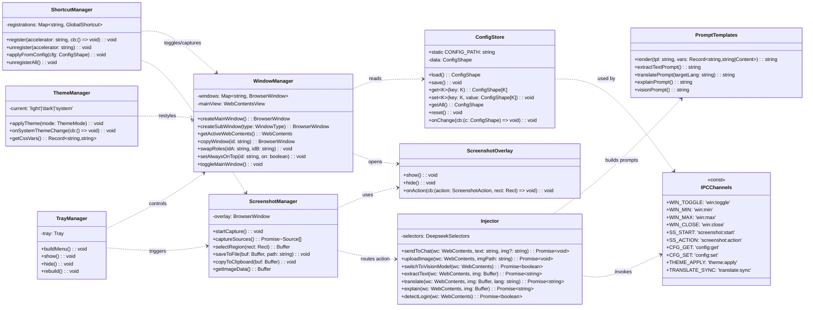
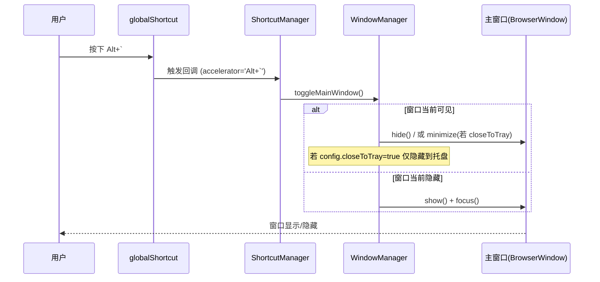
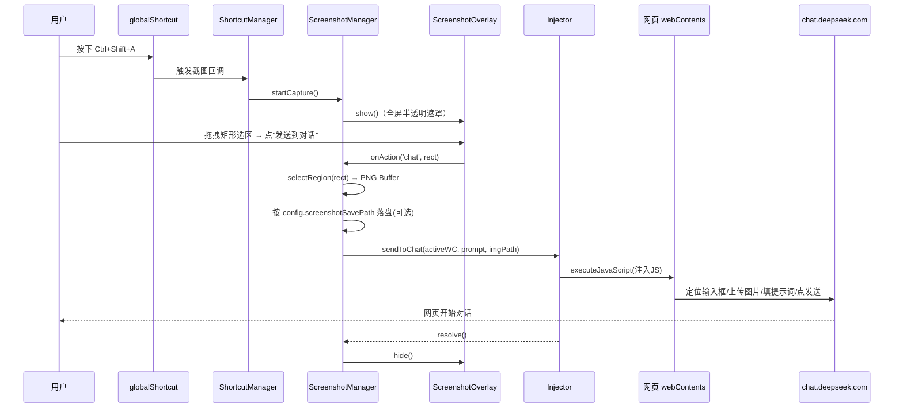
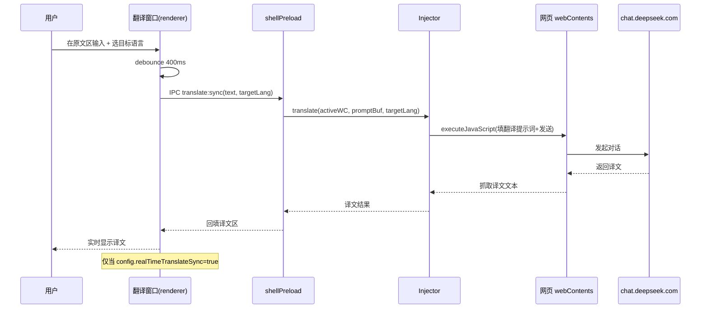

# DeepSeek Desktop 系统架构设计 + 任务分解

> 作者：架构师 高见远（Gao）
> 输入：产品经理 许清楚 的 PRD（三方决策已锁定：Electron + WebContentsView 内嵌网页版 + 嵌入浏览器手动登录）
> 读者：主理人（归档）→ 工程师（批量实现）

---

## 1. 实现方案 + 框架选型

### 1.1 核心难点

| 难点 | 说明 |
|------|------|
| 网页 DOM 选择器脆弱性 | chat.deepseek.com 改版会导致注入失效；需把选择器集中到一处配置，接受"随改版需维护"的风险 |
| 跨平台截图/快捷键差异 | Windows 为主（用户 win32），macOS/Linux 需权限引导与实现差异说明 |
| 登录态持久化 | 用 Electron `session` 持久化到磁盘，跨启动保留；失效时引导重新登录 |
| 多窗口与登录态一致 | 主窗口 + 各副窗口共享同一 Electron session，加载同一网址，登录态天然一致 |
| 实时翻译语义 | 走 DeepSeek 对话（消耗额度），由 `realTimeTranslateSync` 开关控制，防抖默认 400ms |
| 识图模型自动切换 | JS 触发尝试，失败则提示手动点击，不阻断流程 |

### 1.2 框架与库选型（及理由）

| 维度 | 选型 | 理由 |
|------|------|------|
| **Electron 版本** | **Electron 31+**（稳定版） | `WebContentsView` 自 Electron 30 起稳定可用；`BrowserView` 已弃用。统一用 `WebContentsView` 承载网页，避免混用两套 API。Node 22 兼容 |
| **外壳 UI 实现** | **原生 HTML/CSS/JS**（不引 React） | 本应用是"网页封装壳"，外壳仅含自定义标题栏、截图遮罩、轻量副窗口（翻译等）。逻辑简单、窗口多、求启动快、依赖少 → 用 vanilla 最直接，避免 React + 打包链路的复杂度和体积 |
| **配置持久化** | **自写 `ConfigStore`（fs 读写 + 单例）** | 配置是扁平 JSON、仅主进程读写；自写 `get/set/load/save` 零依赖、完全可控、便于做默认值合并与迁移。不引 `electron-store`（其优势在渲染进程，本场景不需要） |
| **截图** | **Electron 内置 `desktopCapturer` + 透明遮罩窗口选区** | 免原生依赖、跨平台一致；用 `getSources({types:['screen']})` 取缩略图铺到全屏透明窗口，用户拖拽矩形选区后 canvas 裁剪。Windows 通常无需额外权限；macOS 需"屏幕录制" TCC 权限（见 §7 共享知识） |
| **全局快捷键** | **`electron.globalShortcut`** | 原生全局注册，应用失焦也能触发 `Alt+\``、`Ctrl+Shift+A` 等 |
| **系统托盘** | **`electron.Tray` + `Menu`** | 常驻托盘、菜单（显示/隐藏、截图、新建窗口、设置、退出） |
| **主题** | **`electron.nativeTheme` + CSS 变量** | `theme=light/dark/system` 作用于自定义标题栏与外壳；`system` 监听系统变化。嵌入网页本身的深色由 DeepSeek 自身控制，可额外注入 CSS 兜底 |
| **内容注入** | **`webContents.executeJavaScript()` + 集中选择器** | 向 chat.deepseek.com 注入 JS：定位输入框、设值并 dispatch `input` 事件、触发发送、上传图片、切换视觉模型。所有选择器收口到 `deepseek-selectors.ts` |
| **打包** | **`electron-builder`** | 生成 Windows/macOS/Linux 安装包，配置自动写入 `config.json` 路径与权限请求（macOS entitlements） |
| **测试** | **Jest + ts-jest** | 对 `ConfigStore`、提示词模板、选区计算、注入选择器逻辑做单测（DOM 用 mock） |

### 1.3 进程与模块划分（架构模式：主进程编排 + 渲染外壳 + WebContentsView 承载网页）

```
┌─────────────────────────────────────────────────────────────┐
│ 主进程 (Node.js)  ── 编排核心                                  │
│  ConfigStore / WindowManager / ScreenshotManager /            │
│  ShortcutManager / TrayManager / ThemeManager / Injector /    │
│  PromptTemplates / IPC handlers                               │
└───────┬──────────────────┬──────────────────┬────────────────┘
        │ IPC              │ IPC              │ executeJavaScript
        ▼                  ▼                  ▼
┌──────────────┐  ┌──────────────┐   ┌──────────────────────────┐
│ 外壳渲染层    │  │ 外壳渲染层    │   │ WebContentsView (网页)     │
│ (原生 HTML)   │  │ (副窗口)      │   │ chat.deepseek.com         │
│ 标题栏/遮罩/  │  │ 翻译窗口等    │   │ + webviewPreload 注入脚本  │
│ 翻译UI        │  │              │   │                          │
└──────────────┘  └──────────────┘   └──────────────────────────┘
```

- **主进程**：所有系统能力（窗口、截图、快捷键、托盘、配置、注入协调）。
- **外壳渲染层**：纯展示与交互（标题栏按钮、截图遮罩矩形拖拽、翻译窗口 UI），通过 `shellPreload` 经 IPC 与主进程通信。
- **WebContentsView 承载的网页**：用户实际使用的 DeepSeek 页面；`webviewPreload` 提供文件上传钩子与 DOM 辅助；注入动作由主进程 `Injector` 通过 `executeJavaScript` 驱动。

---

## 2. 文件列表及相对路径

项目根目录：`deepseek-desktop/`

```
deepseek-desktop/
├── package.json                     # 依赖与脚本（start/build/pack/test）
├── electron-builder.yml            # 打包配置（三平台、图标、权限）
├── tsconfig.json                    # TypeScript 配置（主进程/渲染分离编译）
├── jest.config.js                   # 测试配置（ts-jest）
├── .gitignore
├── README.md                        # 运行/打包/跨平台权限说明
├── src/
│   ├── main/
│   │   ├── main.ts                  # 主进程入口：app 生命周期、装配各模块、注册 IPC
│   │   ├── constants.ts             # 路径常量、窗口类型枚举、事件名、配置文件名
│   │   ├── config/
│   │   │   └── ConfigStore.ts       # 配置读写（%APPDATA%/DeepSeek/config.json），get/set/load/save + 26 项默认合并
│   │   ├── windows/
│   │   │   ├── WindowManager.ts     # 窗口注册表 + 主/副窗口创建、复制、角色交换、置顶
│   │   │   ├── mainWindow.ts        # 主窗口：自定义标题栏 shell + WebContentsView 加载 chat.deepseek.com
│   │   │   ├── subWindow.ts         # 副窗口工厂（识图/翻译/解释/提取文字，轻量 BrowserWindow）
│   │   │   └── screenshotOverlay.ts # 截图遮罩透明窗口（全屏半透明 + 矩形选区 + 底部动作条）
│   │   ├── screenshot/
│   │   │   └── ScreenshotManager.ts # 全局截图：desktopCapturer 截屏、选区计算、落盘、复制到剪贴板
│   │   ├── shortcuts/
│   │   │   └── ShortcutManager.ts   # 全局快捷键注册/注销（Alt+`、Ctrl+Shift+A、自定义）
│   │   ├── tray/
│   │   │   └── TrayManager.ts       # 系统托盘 Tray + 菜单（显示/隐藏、截图、新建、设置、退出）
│   │   ├── theme/
│   │   │   └── ThemeManager.ts      # 浅/深/跟随系统主题，作用于标题栏与外壳 CSS
│   │   ├── inject/
│   │   │   ├── Injector.ts          # 向网页注入：sendToChat / uploadImage / switchToVisionModel / extract / translate / explain
│   │   │   └── deepseek-selectors.ts# 集中维护 DeepSeek 页面 DOM 选择器（脆弱点唯一收口处）
│   │   ├── ipc/
│   │   │   ├── channels.ts          # IPC 通道名常量（主↔渲染约定，单一来源）
│   │   │   └── handlers.ts          # 主进程 IPC 处理器统一注册入口
│   │   └── prompts/
│   │       └── promptTemplates.ts   # 提示词模板与占位符 {content}/{targetLang} 解析渲染
│   ├── preload/
│   │   ├── shellPreload.ts          # 外壳窗口 preload：暴露安全 API 给标题栏/遮罩/翻译 UI
│   │   └── webviewPreload.ts        # 注入 chat.deepseek.com 的 preload：文件上传钩子、DOM 辅助、登录态探测
│   ├── renderer/
│   │   ├── shell/
│   │   │   ├── titlebar.html        # 自定义标题栏结构（≡菜单 / 标题 / 最小化 / 最大化 / 关闭）
│   │   │   ├── titlebar.css         # 标题栏样式（随主题 CSS 变量切换）
│   │   │   ├── titlebar.js          # 标题栏交互（拖拽移动、按钮、菜单弹出）
│   │   │   ├── overlay.html         # 截图遮罩层结构（全屏半透明 + 选区 + 动作条）
│   │   │   ├── overlay.css          # 遮罩与选区样式
│   │   │   ├── overlay.js           # 矩形选区拖拽 + 动作条（发送到对话/提取/翻译/解释/复制/取消）
│   │   │   ├── translate.html       # 翻译窗口 UI（源/目标语言下拉 + 原文区 + 译文区）
│   │   │   ├── translate.css        # 翻译窗口样式
│   │   │   └── translate.js         # 源/目标语言选择 + 原文变化防抖 → 实时翻译回填
│   │   └── assets/
│   │       └── icons/               # 托盘图标、窗口图标（png/icns/ico 各平台）
│   └── shared/
│       └── types.ts                 # 共享类型：ConfigShape、WindowType、IPCEventMap
├── test/
│   ├── config.test.ts               # ConfigStore 默认值合并/读写/迁移
│   ├── screenshot.test.ts           # 选区矩形计算/裁剪边界
│   ├── prompts.test.ts              # 模板占位符 {content}/{targetLang} 渲染
│   └── injector.test.ts             # 注入逻辑单测（mock DOM，验证选择器命中与事件派发）
└── docs/
    ├── system_design.md             # 本文档
    ├── class-diagram.mermaid        # 类图（见 §3 提取）
    └── sequence-diagram.mermaid     # 时序图（见 §4 提取）
```

---

## 3. 数据结构和接口（Mermaid classDiagram）



**关键接口说明（供工程师直接实现）：**

- `ConfigStore`：`load()` 在启动时读 `config.json`，与 26 项默认值做深度合并；`set()` 后自动 `save()`；`onChange` 供快捷键/主题/托盘热更新。
- `WindowManager.createMainWindow()`：建 `BrowserWindow`（frameless，自绘标题栏），内部挂 `WebContentsView` 加载 `chat.deepseek.com`；`getActiveWebContents()` 返回当前聚焦窗口的网页 `webContents`（注入定位点）；`copyWindow`/`swapRoles` 实现 US-12。
- `ScreenshotManager.startCapture()`：拉起 `ScreenshotOverlay`，用户选区后回调 `rect` 与 `action`；`selectRegion` 用 canvas 裁剪返回 PNG `Buffer`。
- `ShortcutManager.applyFromConfig()`：按配置里的 `globalToggleShortcut`/`screenshotShortcut` 及自定义项注册全局快捷键。
- `Injector.sendToChat(wc, text, img?)`：经 `executeJavaScript` 找到输入框 → 设值+dispatch `input` → 若有图先 `uploadImage` → 点击发送；返回 Promise 便于错误捕获。
- `PromptTemplates.render(tpl, vars)`：把 `{content}`/`{targetLang}` 替换为实际值，供各动作构造发给 DeepSeek 的对话内容。

---

## 4. 程序调用流程（Mermaid sequenceDiagram）

### (a) 全局快捷键 `Alt+\`` 显示/隐藏主窗口



### (b) `Ctrl+Shift+A` 截图 → 选区 → "发送到对话" 注入网页



### (c) 副窗口：翻译窗口实时同步（P1/P2）



---

## 5. 任务列表（有序、含依赖）

> 约定：P0 优先，其次 P1，最后 P2。任务按实现顺序排列；依赖前置任务完成方可开工。

| 任务ID | 对应需求 | 文件 | 一句话描述 | 依赖 |
|--------|---------|------|-----------|------|
| **T01** | 基础设施 | `package.json`, `tsconfig.json`, `electron-builder.yml`, `jest.config.js`, `src/main/main.ts`, `src/main/constants.ts`, `src/shared/types.ts` | 搭建工程骨架：依赖脚本、TS 编译、入口 main.ts 空跑、常量与共享类型定义 | 无 |
| **T02** | C-01 | `src/main/config/ConfigStore.ts` | 实现配置模块：读 `%APPDATA%/DeepSeek/config.json`、26 项默认合并、get/set/save/onChange | T01 |
| **T03** | W-01 | `src/main/windows/WindowManager.ts`, `src/main/windows/mainWindow.ts` | 主窗口 + WebContentsView 加载 chat.deepseek.com；窗口注册表与 getActiveWebContents | T01,T02 |
| **T04** | TH-02 | `src/renderer/shell/titlebar.html`, `titlebar.css`, `titlebar.js`, `src/preload/shellPreload.ts` | 自定义标题栏外壳 UI（拖拽/最小化/最大化/关闭/菜单）与 shellPreload 桥接 | T03 |
| **T05** | W-02 | `src/main/shortcuts/ShortcutManager.ts`, `src/main/ipc/channels.ts` | 全局快捷键模块 + IPC 通道常量；实现 `Alt+\`` 显示/隐藏 | T01,T03 |
| **T06** | T-01 | `src/main/tray/TrayManager.ts` | 系统托盘 Tray + 菜单（显示/隐藏、截图、新建窗口、设置、退出） | T01,T03 |
| **T07** | TH-01 | `src/main/theme/ThemeManager.ts` | 主题模块：light/dark/system 作用于标题栏与外壳 CSS 变量，监听系统变化 | T04 |
| **T08** | S-01 | `src/main/screenshot/ScreenshotManager.ts` | 截图模块：desktopCapturer 截屏、选区计算、落盘、复制到剪贴板 | T01 |
| **T09** | S-01 | `src/main/windows/screenshotOverlay.ts`, `src/renderer/shell/overlay.html`, `overlay.css`, `overlay.js` | 全屏半透明遮罩 + 矩形选区拖拽 + 底部动作条 UI | T08 |
| **T10** | V-01,S-02~S-06 | `src/main/inject/Injector.ts`, `src/main/inject/deepseek-selectors.ts` | 注入模块与集中选择器：sendToChat/uploadImage/switchToVisionModel/extract/translate/explain/detectLogin | T03 |
| **T11** | W-01,US-01 | `src/preload/webviewPreload.ts` | 注入 chat.deepseek.com 的 preload：文件上传钩子、DOM 辅助、登录态探测回报 | T03,T10 |
| **T12** | S-02~S-06 | `src/main/ipc/handlers.ts` | 截图动作流集成：遮罩动作 → 截图 → 提示词 → 注入网页（发送到对话/提取/翻译/解释/复制） | T09,T10,T13 |
| **T13** | V-01,S-03~S-05 | `src/main/prompts/promptTemplates.ts` | 提示词模板模块：{content}/{targetLang} 占位符渲染，含 5 个模板默认值 | T02 |
| **T14** | W-03~W-06 | `src/main/windows/subWindow.ts` | 副窗口工厂（识图/翻译/解释/提取文字），复用标题栏与共享 session | T03,T04 |
| **T15** | W-10,TR-01,P2 | `src/renderer/shell/translate.html`, `translate.css`, `translate.js` | 翻译窗口 UI：源/目标语言下拉 + 原文区 + 译文实时回填（防抖+realTimeTranslateSync） | T14 |
| **T16** | W-08,W-09 | `src/main/windows/WindowManager.ts`(扩展) | 窗口复制 copyWindow 与角色交换 swapRoles（US-12） | T03,T14 |
| **T17** | SH-01,C-02 | `src/main/shortcuts/ShortcutManager.ts`(扩展), settings UI | 快捷键自定义（覆盖默认）+ 配置项完整生效（联动主题/托盘/置顶等） | T02,T05,T07 |
| **T18** | C-03,T-02,W-10,TH-03,S-07,V-03 | `src/main/config/ConfigStore.ts`(扩展) | P2 配置落地：代理设置、开机自启、窗口置顶、字号、截图落盘、识图历史 | T02,T16,T17 |
| **T19** | 端到端 | 全模块联调 | 端到端联调：登录态持久化、各动作闭环、跨窗口协同、错误处理 | T11,T12,T15,T18 |
| **T20** | 质量/交付 | `test/*`, `README.md` | 单元测试（ConfigStore/截图/提示词/注入）+ 打包配置 + 跨平台权限说明文档 | T19 |

---

## 6. 依赖包列表（package.json 关键项）

```jsonc
{
  "dependencies": {
    // 运行时零第三方依赖：截图/快捷键/托盘/主题均用 Electron 内置能力
  },
  "devDependencies": {
    "electron": "^31.0.0",            // 核心框架（WebContentsView 稳定）
    "electron-builder": "^24.13.0",  // 三平台打包（写入权限/图标/安装器）
    "typescript": "^5.5.4",          // TS 编译（主进程 + 渲染层）
    "@types/node": "^22.0.0",        // Node 22 类型
    "jest": "^29.7.0",               // 单元测试
    "ts-jest": "^29.2.0",            // Jest 的 TS 转译
    "@types/jest": "^29.5.0"
  },
  "scripts": {
    "start": "electron .",
    "build": "tsc -p tsconfig.json",
    "pack": "electron-builder --dir",
    "dist": "electron-builder",
    "test": "jest"
  }
}
```

> 说明：刻意不引入 `electron-store`、截图库、React 等，保持运行时零依赖、包体小、启动快。所有系统能力由 Electron 内置 API 提供。

---

## 7. 共享知识（跨文件约定）

### 7.1 配置路径常量
- 配置文件：`path.join(app.getPath('userData'), 'config.json')`，其中 `userData` 在 Windows 上即 `%APPDATA%/DeepSeek`（app `name` 设为 `DeepSeek`）→ 与 PRD 的 `%APPDATA%/DeepSeek/config.json` 一致。
- 常量集中定义于 `src/main/constants.ts` 的 `CONFIG_PATH`，全工程引用，禁止硬编码路径。

### 7.2 窗口类型枚举（WindowType）
```ts
type WindowType = 'main' | 'vision' | 'translate' | 'explain' | 'extract';
```
- `main` 用 `WebContentsView` 承载网页；其余为轻量 `BrowserWindow` 加载同一网址（共享 session）。

### 7.3 IPC 通道名约定（channels.ts 单一来源）
主进程 ↔ 外壳渲染层 用以下通道（preload 中 `contextBridge` 暴露为安全 API）：

| 通道 | 方向 | 用途 |
|------|------|------|
| `win:toggle` / `win:min` / `win:max` / `win:close` | 渲染→主 | 标题栏按钮 |
| `screenshot:start` | 渲染→主 | 触发截图 |
| `screenshot:action` | 渲染→主 | 遮罩动作（chat/extract/translate/explain/clipboard/cancel）+ rect |
| `config:get` / `config:set` | 双向 | 配置读写（设置 UI） |
| `theme:apply` | 主→渲染 | 主题切换时重刷 CSS 变量 |
| `translate:sync` | 渲染→主 | 翻译窗口实时同步 |
| `login:status` | 主→渲染 | 登录态探测结果 |

### 7.4 选择器集中点
- 所有 chat.deepseek.com 的 DOM 选择器定义在 `src/main/inject/deepseek-selectors.ts`（如输入框、发送按钮、模型切换、文件上传 input）。**唯一收口处**，改版只动这里。
- 注入失败统一走 `try/catch` + `console.warn`，并触发"如需手动操作"的轻提示，不阻断应用。

### 7.5 提示词模板占位符约定
- `{content}`：待发送内容；`{targetLang}`：目标语言。
- 模板来自 `ConfigStore` 的 5 个 `*PromptTemplate` 字段，由 `PromptTemplates.render()` 渲染。
- 默认模板见 PRD §4（vision/extract/translate/explain 等）。

### 7.6 跨平台权限与实现说明
- **Windows（主目标）**：截图/全局快捷键通常无需额外权限；`globalShortcut` 直接可用。
- **macOS**：需在 `electron-builder.yml` 配 `entitlements` + Info.plist 申请"屏幕录制"权限（`desktopCapturer` 首次会弹系统授权）；全局快捷键可用但需用户在"系统设置→隐私与安全"授予辅助功能权限。`Tray` 在 macOS 顶部菜单栏常驻。
- **Linux**：`desktopCapturer` 依赖 X11/Wayland 的屏幕捕获能力；全局快捷键依赖窗口管理器；托盘用 AppIndicator（部分桌面需 `libappindicator`）。README 注明各平台前置依赖。

### 7.7 登录态与会话
- 所有窗口共享同一 Electron `session`（默认 `session.defaultSession`），登录态天然一致、持久化到磁盘（跨启动保留）。
- `webviewPreload` 周期性探测登录态（检测登录页/登出标志），经 `login:status` 回报；失效时主窗口提示"请重新登录"。

---

## 8. 待明确事项（本阶段仍无法决断、需后续确认）

> PRD §6 的 8 项已在本设计中以合理默认值决断（见 §1.1/§1.2），以下为真正遗留的开放点：

1. **DeepSeek 页面具体选择器值**：`deepseek-selectors.ts` 的初值需首版实机抓取 chat.deepseek.com 当前 DOM 后填入；上线后随网页改版维护（已收口到单文件，但首值待抓）。
2. **自动切视觉模型的具体触发方式**：已决断"JS 触发、失败提示手动"，但具体是点击哪个按钮/开关、是否有中间态（如确认弹窗），需实机确认选择器与交互序列。
3. **多显示器 / 高 DPI 选区**：跨屏截图时各显示器缩略图拼接、DPI 缩放下的坐标换算细节，本设计采用"主屏全屏遮罩 + 选区"简化方案，多屏一致体验需联调验证。
4. **实时翻译的额度与成本提示**：已决断走 DeepSeek 对话（消耗额度）且由 `realTimeTranslateSync` 控制；但是否在 UI 上提示"实时翻译将消耗额度"、是否设每日上限，需产品确认。
5. **CSP / 上传图片方式**：`uploadImage` 若采用"设 files 到 `<input type=file>` + dispatch change"通常不受 CSP 限制；若 DeepSeek 改用 fetch 直传则需规避 CORS，需联调确认上传通道。
6. **配置迁移策略**：旧版 `config.json` 缺字段/多字段时的迁移规则（仅深度合并默认值？还是版本号驱动迁移？）本设计用"默认值深度合并"兜底，正式迁移规则待定。
7. **开机自启实现差异**：Windows 用 `app.setLoginItemSettings`；macOS 需打包后 Login Items 授权；是否要求"最小化到托盘启动"（minimizeToTrayOnStart）的默认行为在 macOS 上的体验，待联调。

---

_（本文档配套图见 `docs/class-diagram.mermaid` 与 `docs/sequence-diagram.mermaid`）_
